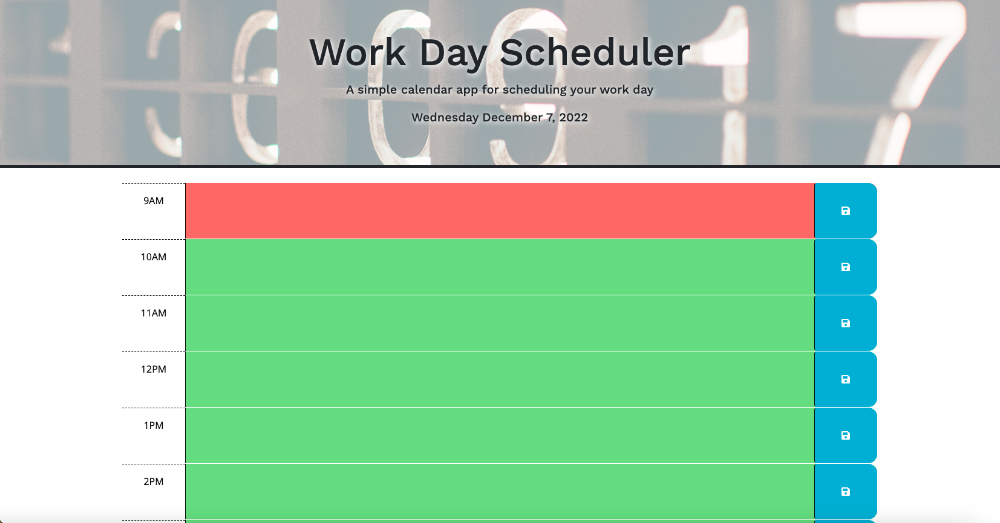

# Work-Day-Scheduler
Third Party APIs

## Description
A simple calendar app for scheduling a work day. App uses: HTML, JavaScript, CSS, BootStrap and jQuery.

## Screenshot

## Link to Deployed Application
https://yankeeknight.github.io/Work-Day-Scheduler/

## Credits
1. "header.jpg" unsplash.com, https://unsplash.com/photos/yD5rv8_WzxA

## Purpose/Usage
As an employee with a busy schedule, I want a place to add important events to a daily planner to be able to manage my time effectively.

## License

Please refer to the LICENSE in the repo.

---
